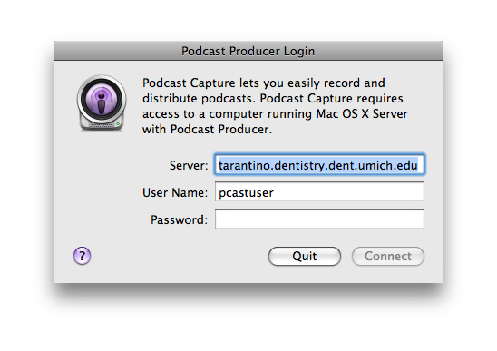

Automaton
===============

1. Development Computer Setup
  1. Dependencies
  2. Setting up the development Tools

2. Podcast Producer Server Setup
  1. Dependencies
  2. Configuring Open Directory
  3. Configuring Xgrid
  4. Configuring Podcast Producer
  5. Initializing the Workflows

3. Xgrid Agent Setup

4. Podcast Producer Recording Machine Setup

5. Using the Workflow Tools
  1. Getting the Workflows on your development Machine
  1. Generating a new course Workflow
  1. Adding the Workflow to the Repository
  1. Installing the Changes to the Podcast Producer machine

Development Computer Setup
---------------------------
### Dependencies
To use the development tools you will need to have the ruby programming language and [git](http://git.or.cz/) installed on your development machine.

### Setting up the development tools
The development of UM's podcast workflows happens through a custom [rubigen](http://rubigen.rubyforge.org/) generator called [Automaton](http://github.com/trek/um-automaton/) that install system-wide. Install this generator on your computer using rubygems:

`sudo gem install trek-automaton -s http://gems.github.com`

This will install the Automaton gem and all of it's dependencies. You are now ready to create new Podcast Producer workflow bundles based on the UM School of Dentistry Template.

The Automaton gem is *only* required on development machines.

Sometimes the Automaton gem will be updated to include new features. To updated the gem (and ensure that future generated workflows are correctly formatted) use:

`sudo gem update trek-automaton -s http://gems.github.com`

Podcast Producer Server Setup
---------------------------
### Dependencies
Podcast Producer **absolutely requires** properly configured forward and reverse DNS.  On a Unix computer you can verify this using the `host` command.  To check and address like fellini.dent.umich.edu, enter:

`host fellini.dent.umich.edu`

If forward DNS is configured properly you should see the IP address of this machine:

`fellini.dent.umich.edu has address 141.211.159.166`

Running `host` again with the IP address should return a domain name pointer if *reverse* DNS is correctly configured.

`host 166.159.211.141`

`166.159.211.141.in-addr.arpa domain name pointer fellini.dent.umich.edu.`

If you do not receive a response like this, reverse DNS is not correctly configured and Podcast Producer will not function properly.

Your Podcast Producer machine will also need to have git installed.

### Configuring Open Directory
Podcast Producer uses Open Directory to authenticate both users recording new podcasts and other services that make up the Producer Producer system.

For full Directions for configuring Open Directory see the *Configuring the Open Directory Service* section of Apple's [*Podcast Producer Administration*](http://images.apple.com/server/macosx/docs/Podcast_Producer_Admin_v10.5.pdf) guide.

### Configuring Xgrid
For full Directions for configuring Open Directory see the *Configuring Xgrid Service* section of Apple's [*Podcast Producer Administration*](http://images.apple.com/server/macosx/docs/Podcast_Producer_Admin_v10.5.pdf) guide.  This guide has directions for setting up an Xgrid Controller and an Xgrid Agent on the same machine.

A more recommended setup is to have Podcast Producer, Open Directory, and the Xgrid Controller on one machine and Xgrid Agents on separate machines.  To use this architecture follow the directions in Podcast Producer Administration guide. After the last step:

1. Return to the Xgrid Service configuration in Server Admin.
2. Select "Settings" from the list of section in the top bar
3. Select the "Agent" tab
4. Uncheck the "Enable Agent Service" option

Setting up Agent computers will be covered in Section 3 of this document.

### Configuring Podcast Producer
In the section titled *Setting Up Podcast Producer* From the [*Podcast Producer Administration*](http://images.apple.com/server/macosx/docs/Podcast_Producer_Admin_v10.5.pdf) guide follow the directions in the section named *Configuring General Settings*

To set the specific Workflow Settings used at the Dental School:

1. Open Server Admin. 
2. In the Computers and Services list, select Podcast Producer. 
3. Click Settings. 
4. Click Properties. 
5. Click the triangle next to Default Properties to display the properties. 

Set your properties as follows:

* Administrator Short Name:
  pcastadmin 
* Group Administrator User:
  pcastadmin 
* Group Administrator Password:
  pcastadmin’s password 
* iTunes U Posting Credentials:
  UM's Posting Credentials
* iTunes U Shared Secret:
  UM's Shared Secret
* iTunes U Site Url:
  umich.edu
* iTunes U Tab id:
  0.0

### Initializing the Workflows
Podcast Producer ships with a set of default workflows. We will overwrite these with the School of Dentistry's custom workflows.  These workflows are stored in a central code repository called github.  To replace the default workflows with the custom workflows

1. In the Finder, open */Library/PodcastProducer*
2. Delete the *Workflows* folder (you may be promoted for your administrator credentials)
3. Open the */Library/PodcastProducer* in terminal with

  `cd /Library/PodcastProducer`

4. Install the custom workflows using git with:
  
  `sudo git clone git://github.com/trek/um-podcastproducer-workflows.git Workflows`

Your custom workflows are now installed and will be recognized by Podcast Producer

Xgrid Agent Setup
---------------------------

Podcast Producer Recording Machine Setup
----------------------------------------
For a recording machine to capture new recordings and upload them to your Podcast Producer Machine. On a recording machine, open the *Podcast Capture* application in *Applications/Podcast Capture*.  In the Preferences for Podcast Capture enter the url, pcastadmin user name, and pcastadmin password to connect the recording machine to Podcast Producer.

Using the Workflow Tools
---------------------------

Now that you have successfully set up the entire Podcast Producer system, you can be begin to change the installed Workflows to match new courses.  Adding, removing, and updating workflows should be done *only* on a development machine. Changes made directly on the production machines will be overwritten.

### Getting the Workflows on your development Machine
You will need to download the Workflow project to your development machine to make changes to the project. To download the project, go to [http://github.com/trek/um-podcastproducer-workflows/](http://github.com/trek/um-podcastproducer-workflows/tree/master) and click the "Your Clone URL:" link.  Copy the resulting text (which will similar to `git clone git@github.com:trek/um-podcastproducer-workflows.git `).

in Terminal:

change into a directory where you would like to keep this project

`cd path/to/a/project/folder`

paste the text of the "Your Clone URL" link.

`git clone git@github.com:trek/um-podcastproducer-workflows.git`

chance into this new direcory

`cd um-podcastproducer-workflows`

You now have the custom workflows on your development machine.

### Generating a new course Workflow
Each course you would like to capture recordings for will need it's own workflow. The workflows of different courses are mostly identical and differ only in a few variables.  To encapsulate these similarities we use a rubigen generator to create mostly identical workflows.  You can use this generator in the Workflows project wit the script/generate course command in Terminal.  This command takes three arguments: the name of the course, the iTunes U tab id of the audio tab and the the iTunes U tab id of the video tab. For example:

`script/generate course "782: Clincal Dental Prosthesis" 1234567.8716161 1048282.9191919`

This will create the necessary folder structure with the information entered in the correct files for Podcast Producer. 

The course name cannot contain the characters '/' or '&'.  Using these characters will cause the workflow to fail.

You can obtain the tab ids by dragging the tabs from iTunes U into a plain text editor.  This will copy the full url of the tab. You will use only the two part numeric idea (separated by a '.'). The rest of the should be removed before running `script/generate course`

### Adding the Workflow to the Repository
Once you've added or edited a workflow, you should add your changes to the local git repository. This can be done in the Terminal with the `git add` with the name of the workflow you added. For example:

`git add "782 Clincal Dental Prosthesis"`

This will add the content to the repository. To commit your additions use `git commit` with a commit message. For example:

`git commit -m "added 782"`

This will commit the content to the local repository. When you are ready to add this content to the remote repository (the location where production machines will pull changes) use `git push` 

`git push`

This will move the local content to the remote repository.

### Installing the Changes to the Podcast Producer machine
To apply your changes on the Podcast Producer production servers, `cd` into the */Library/PodcastProducer/Workflows* with 

`cd /Library/PodcastProducer`

You can then update the workflows to the latest version of the project with

`sudo git pull`

You will be promoted for your administrator username and password.

You should not make local changes to the Workflows folder on the production machines. These changes will be overwritten.